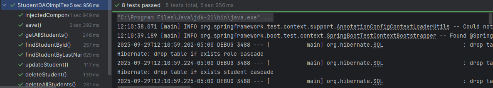

# Project Contents

Basic CRUD actions on Student table and created MyRunner that implements CommandLineRunner to run sql insert queries when
application starts. 


## Dependencies needed to run the project
    - spring-boot (starter-web, data-jpa, starter-test, starter-security, starter-thymeleaf), 
    - springdoc-openapi-starter-webmvc-ui, lombok, spring-boot-starter-validation, hibernate-validator, mysql-connector, h2 database

## Tasks

* [x] Creation of Entity named Student, User, and Role 
* [x] DAO, service and controller implementation
* [x] Accessing data with MySQL 
* [x] Accessing Data with JPA - JPA Query, named parameters in the JPQL and sql (parameterized queries)
* [x] Testing JPA and service layer
* [x] REST API calls over HTTP
* [x] Exception handlers
* [x] Externalized the jdbc configuration using environment variables in Properties file
* [x] Used @Value annotation to inject environment variable(user password) into SecurityConfig class 
* [x] RESTAPI Security-restrict endpoints based on user roles
* [x] Spring MVC Validation - Required fields, @InitBinder, Number range, Regex, Custom messages(messages.properties), Custom
        Java Annotation class, Custom Validation rule

## Used cURL to send HTTP requests

*Included security credentials in cURL request* examples

Get

```
curl -u lily:test localhost:8080/students/2

{"id":2,"firstName":"Lily","lastName":"Public","age":12,"email":"lily@comp.com","major":"stu_Chemistry"}
```
Get request: error response

```
curl -u lily:test localhost:8080/students/10

{"status":404,"message":"Student with id 10 does not exist!","time":1759173171360}
```

Post

```
curl -u lily:test localhost:8080/students --json "{\"firstName\":\"Sidney\", \"lastName\":\"Royal\", \"age\":\"12\", \"email\":\"sid@comp.com\", \"major\":\"stu_Physics\"}"

Created student with id 4
```

Put

```
curl -u lily:test localhost:8080/students/4   -X PUT --json "{\"firstName\":\"Sidney\", \"lastName\":\"Roy\", \"age\":\"19\", \"email\":\"sid@comp.com\", \"major\":\"stu_Social science\"}"

Student{id=4, firstName='Sidney', lastName='Royal', age=12, email='sid@comp.com', major='stu_Physics'} now changed to Student{id=4, firstName='Sidney', lastName='Roy', age=19, email='sid@comp.com', major='stu_Social science'}
```

Delete

```
curl -u pansy:test localhost:8080/students/1 -X DELETE
 
 Student with id 1 deleted
 ```

curl -u pansy:test localhost:8080/students -X DELETE
```
3 records removed
```

### Tests - service logic is tested in conjunction with the repository layer
- @DataJpaTest

    ```
        Manually instantiated StudentDAO and student objects in test class
        Added H2 database to test classpath
        Ran SQL script using @Sql 
  
    ```   
  

### Unit and Integration Testing
Unit test using JUnit, Mockito, MockMVC
- To test all the controller units
- To serialize and deserialize with Jackson’s ObjectMapper
- To deserialize the objects with Gson library

### Integration testing for endpoint connectivity
- @SpringBootTest and TestRestTemplate in Spring Boot context
- Start the server with H2 Database profile configuration

<br>
<br>
<br>


  


  
