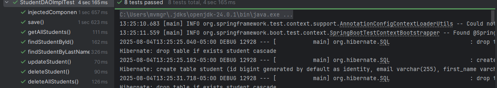

# Project Contents

Basic CRUD actions on Student table and created MyRunner that implements CommandLineRunner to run sql insert queries when
application starts. 


### Dependencies needed to run the project
    - spring-boot starter-web, data-jpa, mysql-connector, h2 database, starter-test
    - spring-boot-starter-validation for using @Valid annotation in Controller class

#### Tasks

* [x] Creation of Entity named Student, DAO, service and controller classes
* [x] Accessing data with MySQL 
* [x] Accessing Data with JPA - EntityManager to interact with the persistence context(crud actions)
* [x] Tests using @DataJpaTest
* [x] Making REST API calls over HTTP
* [x] Exception handlers

### Used curl to send HTTP requests

Get
curl localhost:8080/students/1
 ```{"id":1,"firstName":"Pansy","lastName":"Bran","email":"paul@comp.com"}```

curl localhost:8080/students/10
 ```{"timestamp":"2025-08-03T17:08:39.0768668","message":"Student not found"}```

Post
curl localhost:8080/students --json "{\"firstName\":\"Sidney\", \"lastName\":\"Royal\", \"email\":\"sid@comp.com\"}"
 ```Created student with id 5```

Put
curl localhost:8080/students/4   -X PUT --json "{\"firstName\":\"Sidney\", \"lastName\":\"Roy\", \"email\":\"sid@comp.com\"}"
```
Student{id=4, firstName='Sidney', lastName='Royal', email='sid@comp.com'} updated with Student{id=4, firstName='Sidney', lastName='Roy', email='sid@comp.com'}
```

Delete
curl localhost:8080/students/1 -X DELETE
 ```Student with id 1 deleted```

curl localhost:8080/students -X DELETE
```3 records deleted```

### Tests - service logic is tested in conjunction with the repository layer
- @DataJpaTest

    ```
        Manually instantiated StudentDAO and student objects in test class
        Added H2 database to test classpath
        Ran SQL script using @Sql 
  
    ```   
  


<br>
<br>
<br>

#### Lessons learned

 - TypedQuery are designed for SELECT queries which return results
    - UPDATE queries do not return results. Instead of using a TypedQuery, we can use a standard Query and execute it with executeUpdate().

 - @DataJpaTest doesn’t load service bean, if needed, can manually instantiate the service class in the test setup.

 - @DataJpaTest includes @Transactional by default


 - Difference between spring.jpa.hibernate.ddl-auto: create and create-drop 
    - create: It drops all the tables first then creates new schema when the application starts. The schema saved after the application stops.
    - create-drop: Similar to create, it drops all the tables first then creates new schema when the application starts and drops again when application ends. The schema is removed when the application stops.
  

 - Update and Validate:
    - Update: It does not create or drop any table, but uses the existing tables to add columns or constraints. The schema saved after the application stops.
    - Validate - Hibernate checks the database schema against the entity mappings but does not modify or create the schema

 - Difference between persist() and merge() in Persistence Context
    - Merge returns the managed instance that the state was merged with. Any changes made after the merge is not part of transaction unless we call merge again
    - Persist takes an entity instance, adds it to the context and makes that instance managed (i.e. future updates to the entity will be tracked)
  
 - @ControllerAdvice annotation was first introduced in Spring 3.2 

 - The difference between using ResponseEntity and a simple class object as a return value
    - ResponseEntity allows us to customize the HTTP Responses like error message, staus code and so on. It gives us complete control over what is sent back to the client. 
    - A simple class object return suffices to default HTTP behavior, limited to default error handling, no customizable
  
 - How to reset shared state between tests - error tests pass individually but not when run together
    - Add the @DirtiesContext annotation, but provide it with the AFTER_EACH_TEST_METHOD classMode
    - @DirtiesContext(classMode = DirtiesContext.ClassMode.AFTER_EACH_TEST_METHOD)


 - How to retrieve id from row saved in em.persist(entity)  EntityManager em

    - The ID is only guaranteed to be generated at flush time. Persisting an entity only makes it "attached" to the persistence context. So, either flush the entity manager explicitly:
    - Ex:
          ```em.persist(student);
          em.flush();
          return student.getId();
          or return the entity itself rather than its ID```

  


  